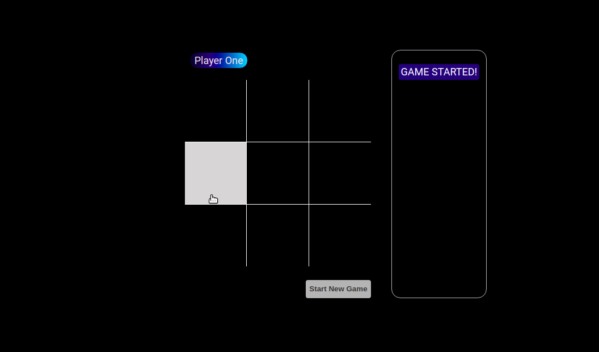

# Tic Tac Toe

A simple tac tac toe game with
- React
- Redux
- Redux-obervables
- GraphQL
- NextJS
- Redis



# Features

1. Persist play state on page reload
1. Shows game logs
1. [Static site generation](front-end/README.md#static-site-generation)

# Requirements for development

1. Docker (^18.03.1)
1. Docker Compose (^1.27.3)

# Services

- `front-end`: the React front end
- `api-server`: a graphQL server for serving the data
- `redis`: a Redis server for storing the temporary data

# Production

Set `ENV=production` in [.env](.env) for all services.

## Run services

```bash
./start
```

## URLs

- front-end: http://localhost:3000
- api-server: http://localhost:4000
- redis: http://localhost:6379 (Same as development)
- [Static site generation](front-end/README.md#static-site-generation)

# Development

Set `ENV=development` in [docker-compose.yml](docker-compose.yml) for all services.

## Run services

```bash
./start [<service name>]
```

## Restart services

```bash
./restart <service name>
```

## Stop a service

```bash
./stop <service name>
```

## Stop all services and remove containers

```bash
./killall
```

## URLs

- front-end: http://localhost:3001
- api-server: http://localhost:4001
- redis: http://localhost:6379 (Same as production)

## View logs

```bash
./logs <service name>
```

## Shell into services

```bash
./shell <service name>
```

## Debug

- [front-end](front-end/README.md#debug)
- [api-server](api-server/README.md#debug)
